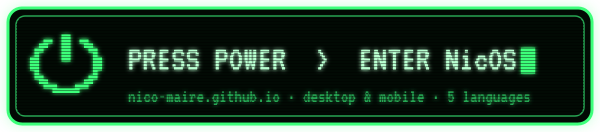

🖥️ <b>On a computer</b>, walk into my office and switch on the PC &nbsp;·&nbsp; 📱 <b>On a phone</b>, it turns into a Nokia

 

 

…or double-click straight into a folder

 

<a href="https://nico-maire.github.io/?lang=es"><kbd>ES</kbd></a>
<a href="https://nico-maire.github.io/?lang=en"><kbd>EN</kbd></a>
<a href="https://nico-maire.github.io/?lang=it"><kbd>IT</kbd></a>
<a href="https://nico-maire.github.io/?lang=fr"><kbd>FR</kbd></a>
<a href="https://nico-maire.github.io/?lang=zh"><kbd>中文</kbd></a>
&nbsp;·&nbsp;
In a hurry? <a href="https://nico-maire.github.io/#/quick"><kbd>Quick view</kbd></a>

